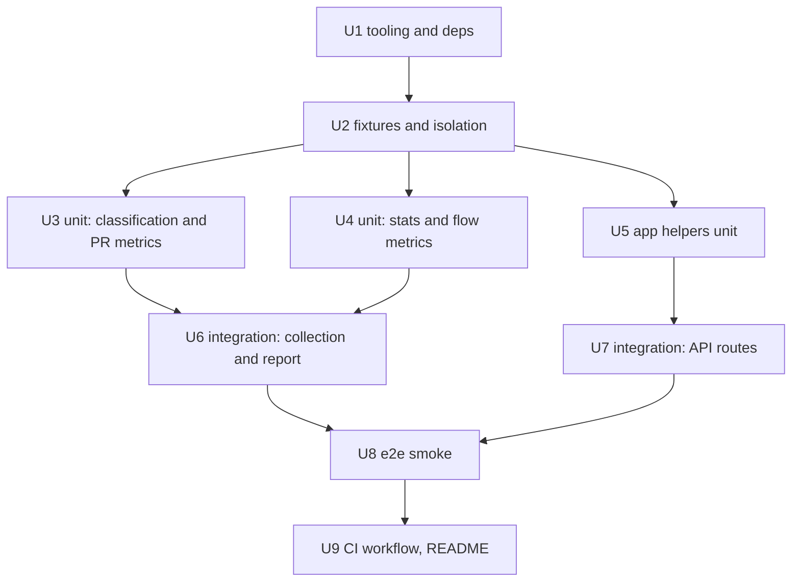

# feat: GitHub Actions CI with a strong pytest suite

## Goal Capsule

- **Objective:** A change to the metrics engine, the API, or the dashboard generator cannot reach `main` with a silently broken flow metric, a broken endpoint, or a dashboard that no longer renders, because every PR is checked automatically against a trustworthy automated test suite.
- **Means:** pytest suite built to the 70/25/5 pyramid, run by a GitHub Actions workflow with a coverage gate (KTD1, KTD4).
- **Authority:** The user's request plus `~/.claude/CLAUDE.md` test-pyramid default. Production behavior stays unchanged except the one dependency fix in U1.
- **Execution profile:** Characterization-first. The code has no tests, so tests pin current behavior (including quirks) rather than redefine it.
- **Stop conditions:** Stop if a test would need real network, `gh`, or a real Gemini key; mock instead. Do not alter metric formulas to make tests pass.
- **Who finishes:** The implementer ships through PR; merge stays with the user.

---

## Product Contract

### Summary

Add tooling, tests, and a CI workflow to a repo that has none. The repo has two Python modules: `analyze.py` (GitHub GraphQL collection via the `gh` CLI, PR classification, flow metrics, static HTML dashboard generation) and `app.py` (FastAPI server: `/api/analyze`, `/api/chat` with Gemini, `/` SPA).

### Problem Frame

Metric logic is dense, date-sensitive, and edited by hand (a 2,200-line `analyze.py`, much of it an embedded HTML template). Nothing verifies it. `app.py` imports `dotenv` but `requirements.txt` does not list `python-dotenv` (it arrives only transitively through `uvicorn[standard]`); an undeclared dependency like that is what CI on a clean environment catches.

### Requirements

- R1. A GitHub Actions workflow runs on every push to `main` and every pull request, installs from `requirements.txt` plus a dev requirements file on a clean runner, and fails on any test failure.
- R2. Tests make no network calls, never invoke the real `gh` or `bws` CLI, never call Gemini, and never read or write the repo's real `raw_data.json` / `dashboard.html`.
- R3. Unit tests cover the pure logic: `parse_date`, `classify_pr`, `process_pr_metrics`, `get_ranks`, `spearman_rank_correlation`, `_parse_repo_slug`, `_interpret_corr`, `_get_gemini_key`, `_build_system_prompt`.
- R4. `compute_flow_metrics` is verified on deterministic, hand-checkable fixtures with time frozen: era stats, SLE percentiles, stage percentiles, active-WIP stage assignment, CFD closed-system invariants, throughput bins, comet lane assignment, empty-input behavior.
- R5. Integration tests cover `collect_data` / `run_graphql_query` / `load_or_collect` (subprocess mocked, pagination, error paths, cache file contents), `analyze_and_build_report` (writes a dashboard to a temp dir), and every FastAPI route through `TestClient` (success, 400, 404, 500, 503).
- R6. A small end-to-end set drives fixture raw data through collect → compute → API analyze → API chat with only the outermost boundaries (`gh`, Gemini) faked, and asserts the generated dashboard HTML contains each documented section.
- R7. The suite measures coverage and CI fails below a floor set from the measured baseline (KTD4).
- R8. Layer mix follows the 70/25/5 guidance: layers are marked (`unit`, `integration`, `e2e`) so the ratio is visible and selectable.
- R9. The CI check is runnable identically on a developer machine with one documented command set (README section).

### Scope Boundaries

- No refactor of `analyze.py` or `app.py`, no splitting of the HTML template, no metric-formula changes.
- No browser/JS tests of `index.html` or `dashboard.html` behavior; the 5% e2e layer asserts generated HTML structure only.
- No Dockerfile, deploy workflow, or release automation.
- Quirks found while characterizing (see Risks) are recorded, not fixed.

---

## Planning Contract

### Key Technical Decisions

- KTD1. **pytest + pytest-cov + freezegun, plain `tests/` directory.** Time-dependence (`datetime.datetime.now()` inside `compute_flow_metrics` and `process_pr_metrics`) is the main determinism hazard; freezegun freezes the module's `datetime` usage without touching production code. Alternative rejected: injecting a clock parameter, because it changes production signatures.
- KTD2. **Network/CLI isolation by default.** An autouse fixture in `tests/conftest.py` replaces `subprocess.run` with a guard that raises unless a test installs its own fake, `chdir`s into `tmp_path`, and clears `GEMINI_API_KEY`/`GOOGLE_API_KEY`. `analyze.RAW_DATA_FILE`/`DASHBOARD_FILE` are relative paths, so the chdir keeps writes out of the repo.
- KTD3. **Synthetic PR fixtures from one builder.** A `make_pr(...)` factory in `tests/factories.py` produces GraphQL-shaped nodes with explicit timestamps, so expected values are computed by hand in the test, not copied from program output. One small committed JSON fixture of raw data (a handful of PRs across eras) serves integration/e2e.
- KTD4. **Coverage gate from measured baseline.** Run once to measure; set `--cov-fail-under` to the measured figure rounded down to a multiple of 5, floor 80, in `pyproject.toml`. Coverage is a regression guard, not the quality claim; the quality claim is the hand-computed assertions.
- KTD5. **Fake Gemini through `sys.modules`.** `app.chat` imports `google.generativeai` lazily inside the handler, so tests inject a fake module via `monkeypatch.setitem(sys.modules, ...)`; the real package need not behave and is never called.
- KTD6. **CI shape.** One workflow, `ruff` (errors-only ruleset: `E9,F63,F7,F82`, i.e., syntax errors and undefined names) then `pytest` on a Python matrix (3.11, 3.13), pip cache, `concurrency` cancel-in-progress, least-privilege `permissions: contents: read`, coverage report uploaded as an artifact. Broader lint rules are out of scope because the existing code was never linted.
- KTD7. **Fix the missing dependency, nothing else.** Add `python-dotenv` to `requirements.txt` (declare what `app.py` imports instead of relying on a transitive install); put test tooling in `requirements-dev.txt`.

### Assumptions

- The user wants GitHub Actions (remote is github.com/yyeret/github-analytics).
- Python 3.11+ is acceptable; the code uses `dict[str, dict]` and `Optional`, so 3.9+ works, 3.11 is the floor tested.

### Sequencing

---

## Implementation Units

### U1. Tooling and dependency fix

- **Goal:** Make a clean install able to import and test the code.
- **Requirements:** R1, R7, R9.
- **Files:** `requirements.txt` (add `python-dotenv`), `requirements-dev.txt` (new: `-r requirements.txt`, `pytest`, `pytest-cov`, `freezegun`, `ruff`), `pyproject.toml` (new: pytest config with `testpaths`, markers `unit`/`integration`/`e2e`, `--strict-markers`, coverage config measuring `analyze` and `app`; ruff errors-only config).
- **Approach:** Config only. No coverage threshold value until U8 measures it (KTD4).
- **Test scenarios:** None (config). Verified by `pytest --collect-only` succeeding and `python -c "import app"` in a fresh venv.
- **Verification:** Fresh venv install from `requirements-dev.txt` imports `app` and `analyze`.

### U2. Shared fixtures and isolation

- **Goal:** Deterministic, network-free test foundation.
- **Requirements:** R2, R8.
- **Files:** `tests/__init__.py`, `tests/conftest.py`, `tests/factories.py`.
- **Approach:** Per KTD2/KTD3: autouse isolation fixture; `make_pr`, `make_commit`, `make_review`, `make_issue` builders; an `isolated_env` fixture; a `fake_gh` helper that returns queued GraphQL JSON payloads to a patched `subprocess.run` and records the command lines.
- **Test scenarios:** `tests/test_isolation.py`: unmocked `subprocess.run` raises; env keys cleared; cwd is a temp dir; factory output has every field `process_pr_metrics` reads.
- **Verification:** Isolation tests pass; `grep` shows no test writes to the repo root.

### U3. Unit: classification and per-PR metrics

- **Goal:** Pin the behavior of the PR classifier and per-PR metric derivation.
- **Requirements:** R3, R8.
- **Files:** `tests/unit/test_parse_date.py`, `tests/unit/test_classify_pr.py`, `tests/unit/test_process_pr_metrics.py`, `analyze.py` (read-only).
- **Approach:** Table-driven pytest parametrization.
- **Test scenarios:**
  - `parse_date`: `Z` suffix; `+00:00` offset; empty and `None` → `None`; garbage → `None`.
  - `classify_pr`: `Bot` typename → Agentic; login containing each of the agentic bot names (case-insensitive); title containing `coderabbit`/`sweep-ai`/`devin`; AI co-author via email, name, and login for each of copilot/aider/claude/gpt → Assisted; three commits with two gaps under 120 s → Assisted; gaps exactly 120 s and non-increasing timestamps → Human; fewer than three commits → Human; `author: null` → Human without error; Agentic precedence over Assisted.
  - `process_pr_metrics`: missing `createdAt` → `None`; unmerged PR → `cycle_time_hours None`; cycle time of exactly 24 h; `pr_size` = additions + deletions; counts of `CHANGES_REQUESTED`/`APPROVED`; wait to first review uses the earliest review; ready-for-review event sets `is_sdd_workflow` and coding time, clamped at 0 when negative; fallback coding time from first commit before creation; first commit after creation → 0; closing issue sets lead time and backlog wait, backlog 0 when first commit precedes issue; no commits → no backlog wait; `merged_ts` in ms.
- **Verification:** `pytest -m unit tests/unit -k "parse_date or classify or process_pr"` passes.

### U4. Unit: statistics and `compute_flow_metrics`

- **Goal:** Verify the aggregates the dashboard and chatbot trust.
- **Requirements:** R4, R8.
- **Files:** `tests/unit/test_stats.py`, `tests/unit/test_compute_flow_metrics.py`.
- **Approach:** Freeze time with freezegun; small hand-computable PR sets; assert values and invariants.
- **Test scenarios:**
  - `get_ranks`/`spearman_rank_correlation`: ties get average ranks; perfectly monotone → 1.0; perfectly inverse → -1.0; constant series → 0.0; mismatched or empty lengths → 0.0; result matches a known textbook value on a 6-point set.
  - `compute_flow_metrics`: empty data returns zeroed era stats, default SLE 12/24, no exception; `recent_stats.total`, averages, and class ratios (sum to 1) on three PRs; flow efficiency per formula `coding/(coding+cycle)`; p50/p85 SLE use Human PRs, fall back to all PRs when no Human; single PR → p85 equals p50; stage percentile floors (`0.02`) and the `0.5 h` clamp; open PR staged by approval / ready-or-reviewed / draft into `3. Merge Delay` / `2. Review Queue` / `1. Active Coding`; open PRs older than the oldest merge are excluded; CFD: `opened == merged + wip` for every row, `merged` non-decreasing, one row per weekly bin plus the final `now` row; throughput per-week totals equal the sum of classes and total across weeks equals merged PRs within the window; comet lane assignment never overlaps two PRs on one lane; `recent_prs_summary` capped at 50; `upstream_breakdown` default `24.0` backlog when no usable first commit.
- **Verification:** `pytest tests/unit/test_stats.py tests/unit/test_compute_flow_metrics.py` passes.

### U5. Unit: `app.py` helpers

- **Goal:** Cover URL parsing, key lookup, and prompt construction.
- **Requirements:** R3, R8.
- **Files:** `tests/unit/test_app_helpers.py`.
- **Test scenarios:** `_parse_repo_slug`: full https URL, http URL, trailing slash, `.git` suffix, `/tree/main/x` tail, bare `owner/name`, whitespace; single token raises `ValueError`. `_interpret_corr`: each band boundary (0.6, 0.3, 0.1, -0.1) and values just either side. `_get_gemini_key`: `GEMINI_API_KEY` wins over `GOOGLE_API_KEY`; falls back to `bws` JSON value on returncode 0; non-zero return code, invalid JSON, `FileNotFoundError`, and timeout all return `None`. `_build_system_prompt`: includes repo name and formatted figures; handles empty metrics (`{}`) without error; skips PRs lacking `cycle_time_hours`; truncates long titles to 60 chars; "No open PRs detected" when WIP empty; averages only the last 8 throughput weeks.
- **Verification:** `pytest tests/unit/test_app_helpers.py` passes.

### U6. Integration: collection and report generation

- **Goal:** Verify subprocess orchestration, caching, and the dashboard writer with `gh` faked.
- **Requirements:** R2, R5.
- **Files:** `tests/integration/test_collect_data.py`, `tests/integration/test_report.py`, `tests/fixtures/raw_data_small.json`.
- **Test scenarios:**
  - `run_graphql_query`: returns `nodes` on success; builds a command containing `gh api graphql`, the search query, and `first=<count>`; `CalledProcessError` → `[]`; payload without `data.search` → `[]`; invalid JSON stdout behavior pinned.
  - `collect_data`: pre-AI query, then paginated merged queries until `hasNextPage` false (cursor passed on page 2 via `-f cursor=`); stops at 6 pages; error on a page breaks out and keeps earlier pages; open-PR failure yields `open_prs == []`; writes `raw_data.json` with `repo`, three PR lists, and `captured_at`.
  - `load_or_collect`: uses cache when present and `force=False` (no subprocess call); `force=True` recollects; corrupt cache recollects.
  - `analyze_and_build_report`: with the small fixture writes `dashboard.html` in the temp cwd; output contains the four documented sections' markers and the repo's data; empty data still writes a file; does not touch the repo's real files.
- **Verification:** `pytest -m integration tests/integration/test_collect_data.py tests/integration/test_report.py` passes.

### U7. Integration: FastAPI routes

- **Goal:** Verify every route and its error mapping.
- **Requirements:** R5.
- **Files:** `tests/integration/test_api.py`.
- **Approach:** `fastapi.testclient.TestClient(app)`; monkeypatch `app._run_analysis`; fake Gemini per KTD5; clear `app._metrics_cache` per test.
- **Test scenarios:** `POST /api/analyze` valid slug and full URL → 200 with metrics and cache populated under the slug; bad URL → 400; `_run_analysis` raising → 500 with `Analysis failed`; `force_refresh` passed through. `POST /api/chat` before analyze → 404; no key → 503; success returns `reply` and passes `assistant` history as `model` role; Gemini raising → 500 `AI error`; system prompt passed to the model contains the repo. `GET /` returns index.html content; returns 404 body when `index.html` is absent (patched `STATIC_DIR`). Request validation: missing fields → 422.
- **Verification:** `pytest tests/integration/test_api.py` passes.

### U8. End-to-end smoke and coverage gate

- **Goal:** Prove the pipeline end to end at the process boundary and lock the coverage floor.
- **Requirements:** R6, R7, R8.
- **Files:** `tests/e2e/test_pipeline.py`, `pyproject.toml` (set `--cov-fail-under` per KTD4).
- **Approach:** Fake only `subprocess.run` (gh) and the Gemini module. Feed fixture payloads through the real `collect_data` → `compute_flow_metrics` → `/api/analyze` → `/api/chat`, then run `analyze_and_build_report` on the same raw data and assert dashboard structure.
- **Test scenarios:** Full flow returns metrics whose `repo`, PR counts, and class ratios match the fixture; chat after analyze returns the fake reply and the prompt reflects the analyzed repo; dashboard HTML contains the CFD, scatter, value-stream, and era-scorecard sections; the repo's tracked files are unchanged after the run.
- **Verification:** Full `pytest` passes with coverage at or above the gate; layer counts reported in the PR show roughly 70/25/5.

### U9. CI workflow and README

- **Goal:** Run the suite automatically and document the local equivalent.
- **Requirements:** R1, R9.
- **Files:** `.github/workflows/ci.yml`, `README.md` (a short "Testing" section).
- **Approach:** KTD6. Steps: checkout, setup-python with pip cache keyed on both requirements files, install, ruff, pytest with `--cov-report=xml`, upload artifact. Triggers: `push` to `main`, `pull_request`. `concurrency` group by ref with cancel-in-progress. `permissions: contents: read`. Pin actions to major versions.
- **Test scenarios:** Workflow YAML validated with a local YAML parse test in `tests/unit/test_ci_config.py` (asserts triggers, matrix, a pytest step, and read-only permissions) so a malformed edit fails a fast test.
- **Verification:** The workflow runs green on the PR itself.

---

## Verification Contract

| Gate | Command | Applies to |
|---|---|---|
| Lint | `ruff check .` | U1, U9 |
| Unit | `pytest -m unit` | U3, U4, U5, U9 |
| Integration | `pytest -m integration` | U6, U7 |
| E2E | `pytest -m e2e` | U8 |
| Full + coverage | `pytest` (coverage gate from `pyproject.toml`) | all |
| Clean install | fresh venv, `pip install -r requirements-dev.txt`, `pytest` | U1, U9 |
| CI | the workflow green on the PR | U9 |

## Definition of Done

- All units complete; full `pytest` green locally on a fresh venv and green in GitHub Actions on the PR.
- No test touches the network, `gh`, `bws`, or the repo's real data files (isolation tests prove it).
- Coverage gate set from measured baseline and enforced in CI.
- Production code changes limited to `requirements.txt`; no formula edits.
- Quirks discovered during characterization are listed in the PR body, not fixed.
- No dead-end or experimental code left in the diff.

## Risks and Open Questions

- Deferred: `compute_flow_metrics` mixes `datetime.now()` and naive timestamps; freezegun covers it, but tests assert behavior on naive UTC parsing, which hides timezone assumptions. Recorded, not fixed.
- Deferred, possible quirks to record rather than fix: `p85_sle` index can equal the list length boundary behavior for small lists; `calc_era_stats` divides by `coding + cycle` and will raise `TypeError` if a PR in `recent_prs` has `cycle_time_hours None` (unmerged PR in the merged set); `analyze_and_build_report` duplicates the CFD logic of `compute_flow_metrics`.
- Deferred: whether to add broader ruff rules later.
