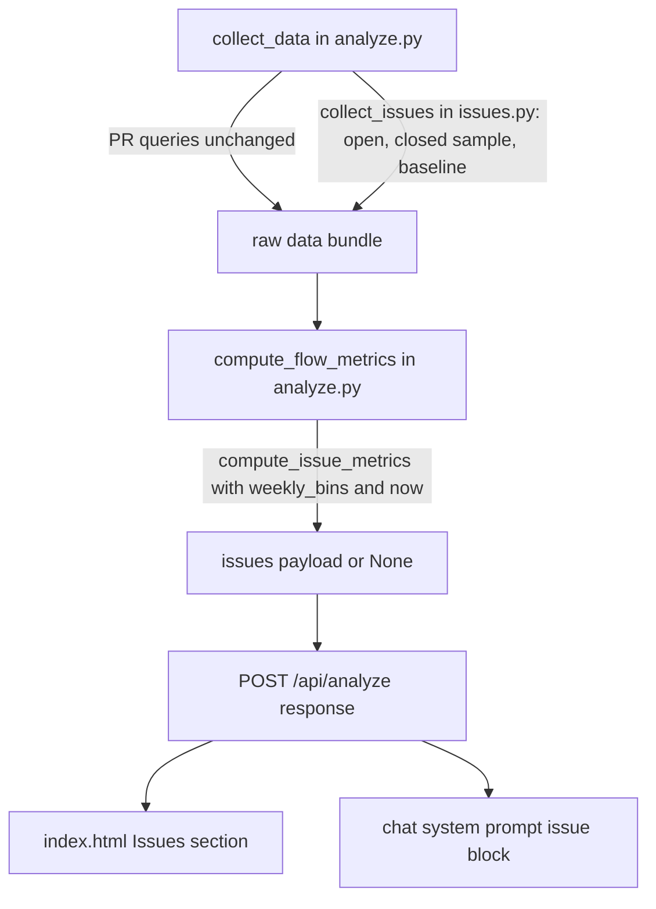

# Issues Analytics - Plan

## Goal Capsule

**Objective:** A user analyzing a repo can see whether its issue backlog is healthy: how fast issues get resolved, whether the backlog is growing, and how much demand never gets resolved.

**Means:** Fetch issues directly, compute backlog metrics in a pure module, and render them as a new section of the live web app (KTD1).

**Leading indicators:**
- Analyzing `sveltejs/svelte` returns an `issues` payload with at least 20 weekly points and no null R3-R7 fields.
- The new pytest suite passes with every Acceptance Example (AE1-AE3) covered by a named test.
- Analyze wall-clock grows by at most 15 seconds against the same repo before this change.

**Product authority:** Issue flow and backlog health only. Responsiveness, issue-mix/AI-impact, and issue-to-PR linkage are not active scope. Surface is the live web app only; `dashboard.html` is frozen.

**Open blockers:** None.

---

## Product Contract

### Summary

Add an Issues section to the live web app. It reports issue cycle time, arrival vs. resolution rate, backlog age and growth, and stale or never-resolved issues. It extends the existing Theory of Constraints view to the upstream side: today issues appear only when a merged PR closes them.

### Problem Frame

`analyze.py` only sees issues through `closingIssuesReferences` on merged PRs, so the Backlog Queue in the CFD and the Backlog Wait stage are survivor-biased. Issues that are never linked to a PR, or never closed, are invisible, and those are exactly the signal that shows demand outrunning capacity.

### Key Decisions

- **Scope is issue flow and backlog health first.** Governs R3, R4, R5, R6, R7. (session-settled: user-directed — chosen over responsiveness, issue mix/AI impact, and issue-to-PR linkage: it extends the existing Theory of Constraints thesis to the upstream side.)
- **Live web app only.** Governs R8, R9. (session-settled: user-directed — chosen over also updating the legacy `dashboard.html` and over a data-layer-only change: the legacy report is a 1,400-line f-string and is frozen.)

### Requirements

**Data scope**
- R1. Issue metrics come from the repo's issues themselves, independent of PR linkage, including issues that are still open and issues closed without a PR.
- R2. Issue data uses the same collection, local caching, and refresh behavior as the existing PR data, and honors the existing force-refresh option.

**Metrics**
- R3. Report issue cycle time (opened to closed) with median and 85th percentile, split by pre-AI baseline era and modern era consistent with the existing era comparison.
- R4. Report weekly arrival rate vs. resolution rate and the resulting net backlog change.
- R5. Report open-backlog size over time and an age distribution of currently open issues.
- R6. Report stale issues: open issues with no activity beyond a threshold, shown as a count and a list sorted by age.
- R7. Report the share of closed issues resolved by a linked PR vs. closed without one.

**Presentation**
- R8. The web app shows these metrics as a new section alongside the existing charts, rendered from the same analyze response.
- R9. The chatbot can answer questions about issue metrics using the same loaded-metrics context it uses for PR metrics.

### Acceptance Examples

- AE1. **Covers R1, R7.** Given an issue closed as "not planned" with no PR, it counts in cycle time and appears in the closed-without-PR share.
- AE2. **Covers R4, R5.** Given a repo where weekly arrivals exceed resolutions for 8 straight weeks, the backlog chart shows rising open count and positive net change each of those weeks.
- AE3. **Covers R6.** Given an open issue with no activity for longer than the threshold, it appears in the stale list with its age.

### Scope Boundaries

**Deferred for later**
- First-response time and responder load.
- Issue type mix by label and AI-era shifts in it.
- Deeper issue-to-PR linkage analysis.
- Static `dashboard.html` output.

**Deferred to Follow-Up Work**
- A user-adjustable stale threshold.
- Honoring `force_refresh` in the web app path, which `app.py` ignores today (`_run_analysis` always refetches).

Product Contract preservation: unchanged except Key Decisions added to record the two session choices, and the four deferred-to-planning questions resolved in place as KTD2, KTD5, and KTD6 (sample cap and truncation, stale threshold and activity definition, PR exclusion).

---

## Planning Contract

### Key Technical Decisions

- KTD1. **Issue collection and computation live in a new `issues.py`**, called from `analyze.py`. `analyze.py` is 2,228 lines with no tests; a separate module with pure functions and an injectable `now` is testable without GitHub or the f-string report generator.
- KTD2. **Closed-issue sample is the 600 most recently updated closed issues; the effective window start is the oldest `updatedAt` in that sample when the sample hit the cap, otherwise the PR window start.** Every unsampled closed issue has `closedAt` at or before that bound, so weeks after it are complete and earlier weeks are dropped rather than shown falsely empty. Open issues are fetched up to the Search API's 1,000-result cap, flagged `open_truncated` when exceeded. Governs R4, R5.
- KTD3. **Open backlog at week W is the count of sampled issues created at or before W that are still open or closed after W.** Weekly bin edges are the ones already built for the CFD, so issue charts align with PR charts. Governs R4, R5.
- KTD4. **Era split reuses the PR baseline.** Baseline is up to 100 issues closed 2021-06-01 to 2021-12-31; modern is sampled closed issues with `closedAt` at or after the effective window start. Percentiles use the existing index rule (`sorted[min(int(n*p), n-1)]`) so issue and PR numbers are comparable. Governs R3.
- KTD5. **Stale means no comment for 90 days, measured from the last comment or, if none, from `createdAt`.** The threshold is a module constant. The payload carries the full stale count and the 25 oldest items. Governs R6.
- KTD6. **PRs are excluded by the `is:issue` search qualifier. "Resolved by a linked PR" means `closedByPullRequestsReferences(includeClosedPrs: true).totalCount > 0`.** Issues closed as not planned stay in cycle time (AE1). The field was verified live against `sveltejs/svelte` on 2026-10-06. Governs R1, R7.
- KTD7. **Issue data fails soft.** A failed or absent issue fetch sets `issues` to `None`; the PR analysis still returns and the UI and chat omit issue content. A cached `raw_data.json` from before this change has no issue key and behaves the same until refreshed. Governs R2, R8, R9.
- KTD8. **The UI reuses `mkChart` and the KPI-card pattern in `index.html`.** No new chart library or layout system. Governs R8.

### High-Level Technical Design

*Directional sketch, not implementation specification.*



Payload shape under the `issues` key: effective window start and truncation flags; baseline and modern cycle-time stats (count, median, p85); weekly series (week, arrived, resolved, net, open count); open-issue age buckets; stale (threshold, count, oldest 25); resolution split (closed total, with PR, without PR).

### Assumptions

- `gh` is authenticated on the host, as the existing PR collection already requires.
- Roughly 17 search calls are added per analysis (up to 6 closed pages, 10 open pages, 1 baseline), well inside GraphQL rate limits.
- Timestamps follow the existing naive-UTC `parse_date` convention.

### Risks & Dependencies

- Repos with more than 1,000 open issues show an undercounted backlog. The `open_truncated` flag lets the UI say so.
- The GraphQL search `sort:updated-desc` ordering is what KTD2's completeness argument relies on; the unit test covers the arithmetic, and the live run in Verification confirms the sample.

---

## Implementation Units

Sequence: U1, then U2, then U3, then U4 and U5 in either order.

### U1. Issue metrics computation

- **Goal:** Pure function that turns raw issue records into the `issues` payload.
- **Requirements:** R1, R3, R4, R5, R6, R7; AE1, AE2, AE3.
- **Dependencies:** none.
- **Files:** `issues.py` (new), `tests/test_issue_metrics.py` (new), `requirements-dev.txt` (new, `pytest`).
- **Approach:** Implement `compute_issue_metrics(issues_raw, weekly_bins, now)` per KTD2 to KTD6. Parse dates with the existing naive-UTC convention. Age buckets are half-open: under 7d, 7 to 30d, 30 to 90d, 90 to 180d, 180 to 365d, over 365d.
- **Execution note:** Write the tests first; AE1 to AE3 become named tests.
- **Test scenarios:**
  - AE1: a closed issue with `stateReason` not planned and zero linked PRs is counted in modern cycle-time `n` and in the without-PR share.
  - AE2: eight consecutive weeks with more arrivals than resolutions give positive `net` each week and strictly rising `open_count`.
  - AE3: an open issue whose last comment is 120 days old is in the stale list with that age; one commented 10 days ago is not; one with no comments created 100 days ago is.
  - Percentiles on durations of 1 to 10 days return median 6 and p85 9 under the KTD4 index rule.
  - An issue created after week W is not in W's open count; an issue closed exactly at W is not.
  - A truncated closed sample drops weeks before the oldest sampled `updatedAt` and sets the truncation flag.
  - An open issue aged exactly 7 days lands in the 7 to 30 day bucket.
  - Empty input returns zeroed stats and empty lists without raising; `None` input returns `None`.
  - Baseline-era issues affect only baseline stats, never the backlog series.
- **Verification:** `python3 -m pytest tests/test_issue_metrics.py -q` passes.

### U2. Issue collection

- **Goal:** Fetch open, recent-closed, and baseline issues and attach them to the raw data bundle without risking the PR flow.
- **Requirements:** R1, R2.
- **Dependencies:** none (parallel with U1).
- **Files:** `issues.py`, `analyze.py` (`collect_data`, the `all_data` dict near line 281), `tests/test_issue_collection.py` (new).
- **Approach:** `collect_issues(repo)` follows the existing `gh api graphql` subprocess pattern in `analyze.py`, with a paging helper. Queries use `is:issue`; the closed query adds `is:closed sort:updated-desc`; the baseline adds `closed:2021-06-01..2021-12-31`. Per issue: `number`, `title`, `createdAt`, `closedAt`, `updatedAt`, `state`, `stateReason`, last comment `createdAt`, and `closedByPullRequestsReferences(first:1, includeClosedPrs:true){totalCount}`. Record truncation per KTD2. Wrap the call so any failure yields `None` (KTD7); `collect_data` stores the result under an `issues` key in the bundle that `raw_data.json` already caches.
- **Test scenarios:**
  - Two stubbed pages with `hasNextPage` true then false are concatenated in order.
  - Hitting the 600 closed cap with more pages available sets `closed_truncated`.
  - A subprocess error or non-JSON output returns `None` and does not raise.
  - Result keys match what `compute_issue_metrics` consumes.
- **Verification:** `python3 -m pytest tests/test_issue_collection.py -q` passes, and `python3 analyze.py sveltejs/svelte --refresh` still writes `dashboard.html`.

### U3. Wire metrics into the analyze response

- **Goal:** `compute_flow_metrics` returns the `issues` payload so `/api/analyze` carries it.
- **Requirements:** R1, R8.
- **Dependencies:** U1, U2.
- **Files:** `analyze.py` (`compute_flow_metrics`, return dict near line 745).
- **Approach:** Call `compute_issue_metrics(data.get("issues"), weekly_bins, now)` after the existing weekly bins are built and add the result under `"issues"`. A missing key or `None` input yields `None` (KTD7). Leave `analyze_and_build_report` untouched.
- **Test scenarios:** `compute_flow_metrics` on a minimal bundle without an `issues` key returns `issues: None` and all existing keys unchanged.
- **Verification:** The test above passes; a live `POST /api/analyze` for `sveltejs/svelte` returns an `issues` object (see Verification Contract).

### U4. Chat context

- **Goal:** The coach can answer questions about the issue backlog.
- **Requirements:** R9.
- **Dependencies:** U3.
- **Files:** `app.py` (`_build_system_prompt`), `index.html` (chat chip list near line 553).
- **Approach:** When `metrics["issues"]` is present, append an issue block to the system prompt: open count, net backlog change over 8 weeks, median and p85 cycle time with the baseline comparison, stale count with the three oldest, and the with/without-PR split. When absent, the prompt is unchanged. Add one chip, "How healthy is our issue backlog?".
- **Test scenarios:**
  - `_build_system_prompt` with an `issues` payload includes the open count and stale count.
  - `_build_system_prompt` with `issues: None` returns the same text as before this change.
- **Verification:** `python3 -m pytest tests/ -q` passes.

### U5. Issues section in the web app

- **Goal:** Render R3 to R7 in the dashboard.
- **Requirements:** R3, R4, R5, R6, R7, R8.
- **Dependencies:** U3.
- **Files:** `index.html` (section markup near line 530, `renderDashboard` near line 633, `renderKPIs` near line 648).
- **Approach:** Add a "Issue Flow & Backlog Health" section after the Batch Size section, hidden unless `d.issues` is non-null (KTD7). Charts via `mkChart` (KTD8): arrivals vs. resolutions as bars with the open-backlog line on a second axis, limited to the last 52 weeks like the CFD; open-issue age distribution as bars. A stale-issues table shows number, title, and days since activity. Add KPI cards for open issues, median and p85 cycle time with the baseline delta badge pattern used by Avg Cycle Time, 8-week net backlog change, stale count, and percent closed via PR. Show a short note when `open_truncated` or the closed sample truncation moved the window.
- **Test scenarios:** Test expectation: none -- covered by the manual browser check in the Verification Contract, since the repo has no browser test harness and the computation behind each chart is covered in U1.
- **Verification:** Browser check per the Verification Contract.

---

## Verification Contract

| Check | Command or action | Applies to |
|---|---|---|
| Unit and integration tests | `python3 -m pytest tests/ -q` | U1, U2, U3, U4 |
| Legacy CLI regression | `python3 analyze.py sveltejs/svelte --refresh` completes and writes `dashboard.html` | U2, U3 |
| API payload | Start `python3 app.py`, then `curl -s -X POST localhost:8000/api/analyze -H 'content-type: application/json' -d '{"repo_url":"sveltejs/svelte"}'` and confirm `issues` has at least 20 weekly points and non-null R3-R7 fields | U3 |
| UI render | In the browser pane, analyze `sveltejs/svelte`; the Issues section shows KPIs, both charts, and the stale table with no console errors | U5 |
| Fail-soft | Analyze with the issue fetch forced to fail (stub returning `None`); the PR dashboard renders and the Issues section is hidden | U2, U5 |
| Latency | Time analyze before and after on the same repo; growth stays within 15 seconds | Goal Capsule indicator |

## Definition of Done

- All nine requirements are traceable to a passing test or a recorded manual check; AE1 to AE3 each have a named test.
- `python3 -m pytest tests/ -q` is green and the legacy CLI still produces `dashboard.html`.
- The Issues section is hidden, not broken, when `issues` is `None`.
- No abandoned experiment code remains in the diff, and `raw_data.json` stays untracked.
- Per unit: U1 and U2 tests written first and passing; U3 existing keys unchanged; U4 prompt unchanged when `issues` is `None`; U5 verified in the browser at desktop width.

## Suggested /goal Loop Prompt

```text
Implement docs/plans/2026-10-06-0619-feat-issues-analytics-plan.md in this repo, unit by unit (U1 to U5), test-first for U1 and U2. After each unit run `python3 -m pytest tests/ -q`. When U5 is done, start `python3 app.py`, analyze sveltejs/svelte, and re-measure the three leading indicators in the Goal Capsule: issues payload has at least 20 weekly points with no null R3-R7 fields, AE1-AE3 each have a named passing test, and analyze time grew by at most 15 seconds. Stop when all three hold and the Definition of Done is met, or when blocked, and report the blocker with the failing check.
```
